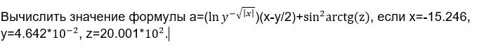
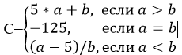

<h1>Лабораторная работа 3 (click)</h1>

## Задание 1:
> Даны два действительных числа x и y. Вычислить их сумму, разность, произведение и частное.
- [Task_1](./лабораторная%20работа%203/Task_3.1.cpp)

## Задание 2:

- [Task_2](./лабораторная%20работа%203/Task_3.2.cpp)

<h1>Лабораторная работа 4 (click)</h1>

## Задание 1
> Проверить истинность высказывания: "Данное целое число является четным двузначным числом". 
- [Task_1](./лабораторная%20работа%204/Task_4.1.cpp)

## Задание 2

- [Task_2](./лабораторная%20работа%204/Task_4.2.cpp)

## Задание 3
> Арифметические действия над числами пронумерованы следующим образом: 1 — сложение, 2 — вычитание, 3 — умножение, 4 — деление. Дан номер действия и два числа A и B (В не равно нулю). Выполнить над числами указанное действие и вывести результат. 
- [Task_3](./лабораторная%20работа%204/Task_4.3.cpp)

## Задание 4
> Значения переменных X, Y, Z поменять местами так, чтобы они оказались упорядоченными по убыванию. 
- [Task_4](./лабораторная%20работа%204/Task_4.4.cpp)

<h1>Лабораторная работа 5(click)</h1>

## Задание 1
> Написать программу вычисления модулей введнных отрицательных чисел до тех пор, пока пользователь не введёт 0 (для положительных чисел выводить просто сообщение).
- [Цикл while](./лабораторная%20работа%205/Task_5.1.1.cpp)
- [Цикл for](./лабораторная%20работа%205/Task_5.1.2.cpp)

## Задание 2
> Вычислить значение функции f(x) на отрезке [a;b] с шагом h, кроме x = a + 2*h 
- [Цикл while](./лабораторная%20работа%205/Task_5.2.1.cpp)
- [Цикл for](./лабораторная%20работа%205/Task_5.2.2.cpp)

<h1>Лабораторная работа 6(click)</h1>

## Задание 1
> Задан массив А из N чисел. N – кратно 3. Это надо проверить. Образовать массив В из сумм каждой тройки чисел массива А.
- [Task_1](./лабораторная%20работа%206/Task_6.1.cpp)

## Задание 2
> Дан двухмерный массив A[1..m,1..n]. Реализовать поиск минимального из максимальных элементов каждой строки матрицы и такой же поиск для столбцов
- [Task_2](./Лабораторная%20работа%206/Task_6.2.cpp)

<h1>Лабораторная работа 7(click)</h1>

## Задание 1
> Задан динамический массив А из N чисел. N – кратно 3. Это надо проверить. Образовать массив В из сумм каждой тройки чисел массива А. Для полученного массива реализовать удаление всех элементов с заданным значением (значение запрашивается с клавиатуры)
- [Task_1](./лабораторная%20работа%207/Task_7.1.cpp)

## Задание 2
> Дан двухмерный динамический массив A[1..m,1..n]. Реализовать поиск минимального из максимальных элементов каждой строки матрицы и такой же поиск для столбцов. Для полученного массива реализовать добавление строки элементов в заданной позиции (значение позиции и элементов строки вводятся с клавиатуры)
- [Task_2](./лабораторная%20работа%207/Task_7.2.cpp)

<h1>Лабораторная работа 8(click)</h1>

## Задание 1
> Ввести строку текста. Определить каких букв – гласных или согласных – больше в этом тексте.
- [Task_1](./лабораторная%20работа%208/Task_8.1.cpp)

## Задание 2
> Дано натуральное число n (n<100). Записать это число русскими словами. Например, пятнадцать, двести тридцать и т.п.
- [Task_2](./лабораторная%20работа%208/Task_8.2.cpp)

